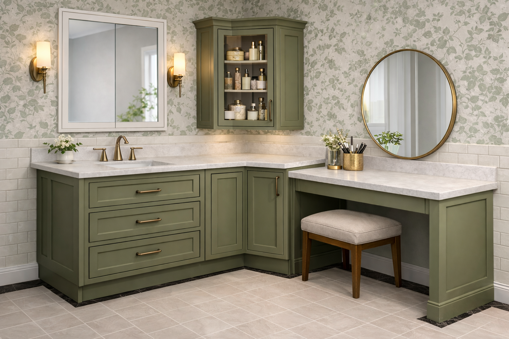

# Mediterranean Revival Bathroom – Material Selections

## Fixtures

- **Toilet:**
  - Kohler **K-3819-0** (Memoirs Stately, elongated, comfort height, 1.6 gpf)
  - Kohler **K-4636-RL-0** (Cachet ReadyLatch Quiet-Close, elongated, white)
  - Replace stock lever with a **Memoirs-compatible left-hand trip lever** in the closest brass/gold finish to the bath hardware.
- **Tub:** Kohler Mariposa 66" x 36" alcove, White
- **Faucets & Trim:** California Faucets – LSG (Lifetime Satin Gold)

---

## Wall Tile

- **Product:** Daltile Restore Ivory
- **Size:** 3" x 6"
- **Finish:** Matte
- **Layout:** Running bond (brick pattern)
- **Color:** Warm ivory

🔗 [https://www.homedepot.com/p/Daltile-Restore-Ivory-3-in-x-6-in-Matte-Ceramic-Wall-Tile-12-5-sq-ft-Case-RE27RCT36MT/332487944](https://www.homedepot.com/p/Daltile-Restore-Ivory-3-in-x-6-in-Matte-Ceramic-Wall-Tile-12-5-sq-ft-Case-RE27RCT36MT/332487944)

---

## Wainscot Strategy

- Tile height: ~42" (48" optional for added durability)
- Clean horizontal cap transition
- Wallpaper above tile on vanity walls

---

## Wallpaper

- **Style:** Sage floral with cream backing
- Installed above tile wainscot on vanity walls
- Door/window wall: painted to match wallpaper cream

(Exact product TBD)

---

## Stone / Countertops

- **Product:** Arizona Tile – Della Terra Quartz
- **Color:** Ivory White Honed
- **Finish:** Honed / Matte
- **Edge Profile:** Small eased edge

🔗 [https://media.arizonatile.com/pis/docs/slab/quartz/Ivory-White-Honed.pdf](https://media.arizonatile.com/pis/docs/slab/quartz/Ivory-White-Honed.pdf)

**Used for:**

- Vanity countertop
- Shower niche sills and returns
- 1.5" tub flange lip detail

---

## Floor

- **Field Tile:** 2" x 2" ivory porcelain
- **Border:** Thin black perimeter band
- **Layout:** Rectangular “framed rug” layout aligned to room
- **Grout:** Warm light gray-beige

(Product selection TBD – porcelain mosaic)

---

## Vanity & Cabinetry

- **Color Direction:** Deep muted olive / moss green
  - Slight gray undertone
  - Darker than wallpaper
  - Warm, earthy tone

- **Shelves:** Match vanity color (primary option)
  OR
  Quartz shelves (elevated alternative)

---

# Overall Palette Summary

- Warm ivory subway
- Cream + sage floral
- Deep olive cabinetry
- Honed creamy quartz
- Satin gold hardware
- Ivory floor with black border
- Crisp white plumbing fixtures
