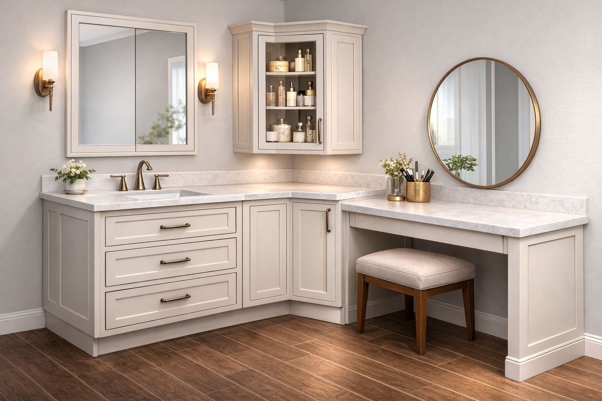
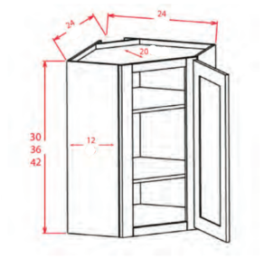

# Vanity Layout Tradeoffs

[back](../README.md)

## Desires

1. **Comfortable daily use** — sink access is easy; seated spot is actually usable.
2. **Maximize storage** — especially for _kid/kid-teen “endless bottles”_ and grooming tools.
3. **Minimize corner waste** — the inside corner should be purposeful, not a black hole.
4. **Looks intentional** — classic / 1917 Mediterranean Revival-ish, not “kitchen hack.”
5. **Upgradeable** — start simple (YAGNI), but leave room to add organizers later if needed.
6. **Good lighting** — 2 sconces flanking the recessed medicine cabinet over the sink.

## Constraints

- **L-shape length:** 54" on each leg from the inside 90° corner.
- **Sink location:** **left leg** (needs access to plumbing stack).
- **Lighting plan:** **two sconces** around the medicine cabinet.
- **Right side conditions:** window + skinny radiator to the right of the vanity area; right-leg storage should avoid heat-sensitive items.
- **Plumbing access:** under-sink cabinet should be **two swing-out doors** (no drawers).

## Options considered

### Layout 1: Seat in the corner (corner “desk”)

**Concept:** The inside corner becomes the seated vanity/makeup spot (chair in the corner), with storage pushed outward on both legs.

**Pros**

- Strong “makeup station” vibe; corner feels like a feature.
- Can be very comfortable if the knee zone is generous.

**Cons**

- Corner lighting + mirror layout gets complicated fast (odd angles, sconces placement).
- Often forces compromises on storage (corner becomes knee space rather than volume).
- Harder to keep the medicine cabinet + 2-sconce sink wall clean and symmetrical.

**Best for**

- If the seated makeup station is the _primary_ function and storage is secondary.

---

### Layout 2: Seat on the right leg (preferred)

**Concept:** Keep the sink wall clean (medicine cabinet + sconces), put a seated “vanity desk” on the right leg, and make the corner do storage work.

**Why it fits our constraints**

- Sink must be on the left leg for the stack — this layout supports that cleanly.
- Sconces flanking the medicine cabinet over the sink is straightforward.
- Corner can be used for bulky storage (towels + hair tools) while upper corner storage holds bottles.

**Pros**

- Best overall balance: sink usability + lighting + storage.
- Corner storage can be scaled (start simple; add organizers later).
- Seated spot is a clean “desk” with a shallow drawer and real knee space.

**Cons**

- Right leg is near radiator → store heat-safe items there (brushes, cotton pads, etc.).
- Corner lower can still become a “reach-in cave” if configured poorly.

**Best for**

- Daily family use where storage is a priority and the makeup spot is “nice and useful” but not the only goal.

## Corner base cabinet configurations (Layout 2)

### Base (lower corner)

#### (A) Static shelves (YAGNI default)

**What it is:** wedge/corner base cabinet with fixed or adjustable shelves.

**Pros**

- Lowest cost and lowest complexity.
- Nothing to break; easy to clean.
- Easy to upgrade later with bins, shelf liners, or aftermarket organizers.

**Cons**

- Reach-in depth can be annoying; items can get buried.
- Needs bins to avoid turning into a junk cave.

**Best use**

- **Bulky items:** towels, hair dryer, curling/flat iron, attachments (in a handled caddy).

**Make it work**

- Use **bins/caddies** for hair tools (cord control) and towels (neater stacking).
- Prefer **adjustable shelves** and **wide-opening hinges** if available.

#### (B) Susan (lazy / kidney / “LeMans”)

**What it is:** rotating or swing-out corner shelves.

**Pros**

- Better access than static shelves for deep corner space.
- Great for towels and bulk items.

**Cons**

- Hair tools + cords can be awkward; items can tip without bins.
- Hardware steals some space; adds cost vs static.

**Best use**

- Towels and TP bulk; hair tools in a bin.

#### (C) Pullout tray system (blind-corner pullout)

**What it is:** trays that pull out and bring stored items toward the opening.

**Pros**

- Best day-to-day access for bulky/awkward items.
- Excellent for hair tools + towels.

**Cons**

- Highest cost and hardware complexity; more to adjust/maintain.
- Can be constrained by door opening and cabinet line.

**Best use**

- Hair tools + towels with solid-bottom trays and liners.

**Decision note:** start with **(A) static shelves**; upgrade only if needed.

---

## Corner upper cabinet configurations (Layout 2)

### Upper corner cabinet

**Goal:** hold “endless bottles” and makeup/hair products; keep clutter out of sight.

**Decision variables**

- **Include upper corner cabinet:** yes/no
- **Footprint:** 15" vs 18"
- **Mounting:** on-counter “hutch” vs wall-mounted above counter
- **Clearance under cabinet:** target **24" above countertop** so the counter below remains usable

#### Yes vs No

- **Yes:** wins on storage and reduces counter clutter (recommended).
- **No:** cleaner look but pushes bottles into medicine cabinet / counters / other drawers.

#### 15" vs 18"

- **15" x 15":** lighter visually; still useful.
- **18" x 18":** meaningfully more capacity for bottles and bins; still reads reasonable in a corner.

#### On-counter vs Wall-mounted above counter

- **On-counter hutch:** most reachable; adds visual “apothecary” vibe; reduces counter landing space.
- **Wall-mounted above counter:** keeps countertop usable; reads lighter; still adds lots of storage.

**Recommended spec**

- **Upper: YES**
- **Footprint: 18"**
- **Mount: wall-mounted**
- **Bottom height: 24" above countertop**
- With an 8' ceiling and ~36" vanity height, this yields a **~36" tall upper** (24" gap + 36" cabinet = 60" to ceiling).

---

## Seated vanity (right leg) configurations (Layout 2)

**Concept:** a simple “desk” like a vanity table.

- **Width:** 30"
- **Drawer:** 1 shallow top drawer (or false front + hidden tray)
- **Knee clearance targets**
  - Height: ~24–26" clear
  - Depth: ~17–19" clear

**Right-leg storage caution**

- Because it’s near the radiator, store **heat-safe** items here:
  - brushes, combs, elastics, cotton pads/swabs, tissues, hair accessories
- Avoid storing:
  - heat-sensitive cosmetics, certain medications, aerosols _if heat is significant_

---

## Example module math (clean fit with 54" legs)

Using a 24" wedge base along each wall:

- Corner wedge consumes **24"** of each 54" leg
- Left remaining: **54 - 24 = 30"** → **30" sink base**
- Right remaining: **54 - 24 = 30"** → **30" seated vanity**

This is a “no weird filler strip” configuration.

---

## Likely decision (current)

**Chosen layout:** **Seat on right leg**

- Corner wedge: **24"** of each 54" leg
- Left: **30" sink base**
- Right: **30" seated vanity**

**Lower corner (base):** **Static shelves** (start simple; add organizers if needed)

**Upper corner:** **Yes**, **18"**, **wall-mounted**, bottom **24" above countertop (starting at 5' and going to the ceiling)**

**Lighting:** **2 sconces** flanking a **recessed medicine cabinet** centered over the sink

---

## Notes / installer checklist

- [ ] Confirm vanity depth (21" typical bath vs 24") and countertop seam plan at the corner.
- [ ] Confirm wedge base cabinet exact size (e.g., 24" along each wall) and door swing.
- [ ] Specify **under-sink = 2 doors** for plumbing access.
- [ ] Set blocking for sconces and medicine cabinet.
- [ ] Set blocking for wall-mounted corner upper (and confirm stud locations).
- [ ] If possible: add an outlet location that supports grooming (under desk, or inside a cabinet).
- [ ] Plan bins/caddies for corner base (towels + hair tools) from day 1 to prevent “corner cave.”
